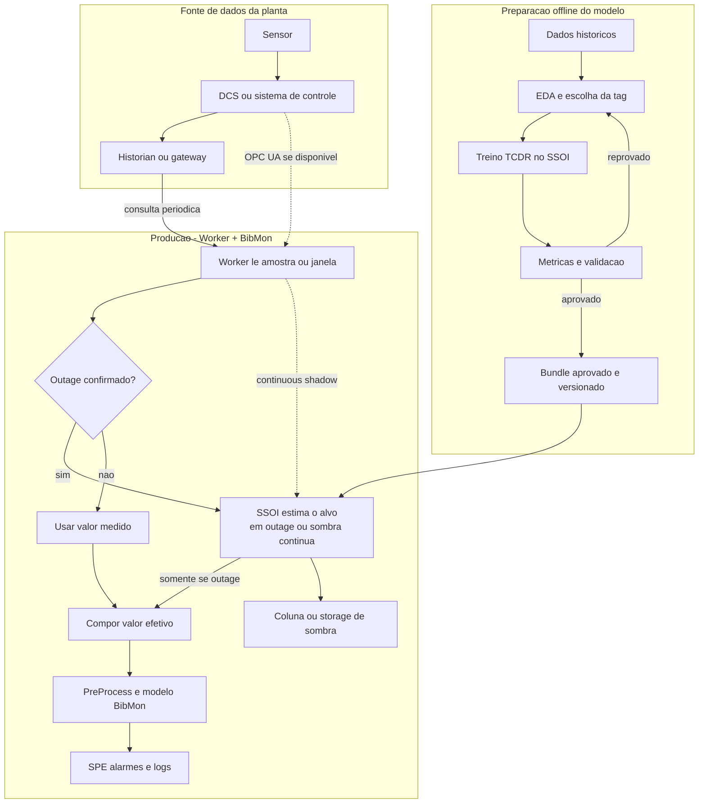
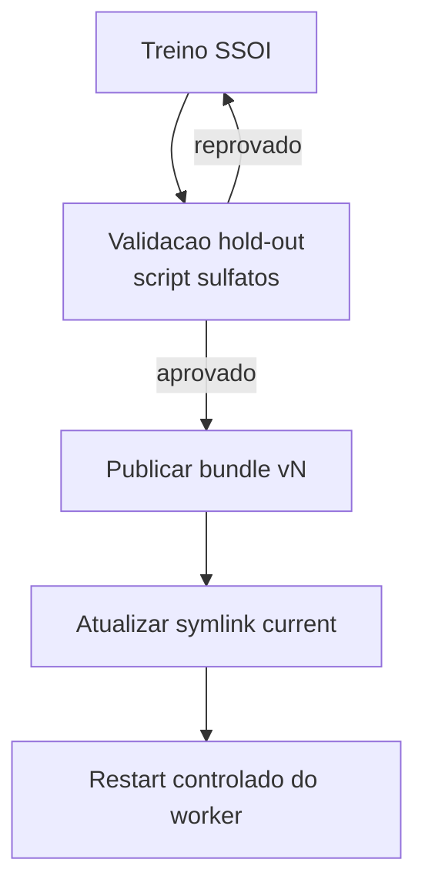
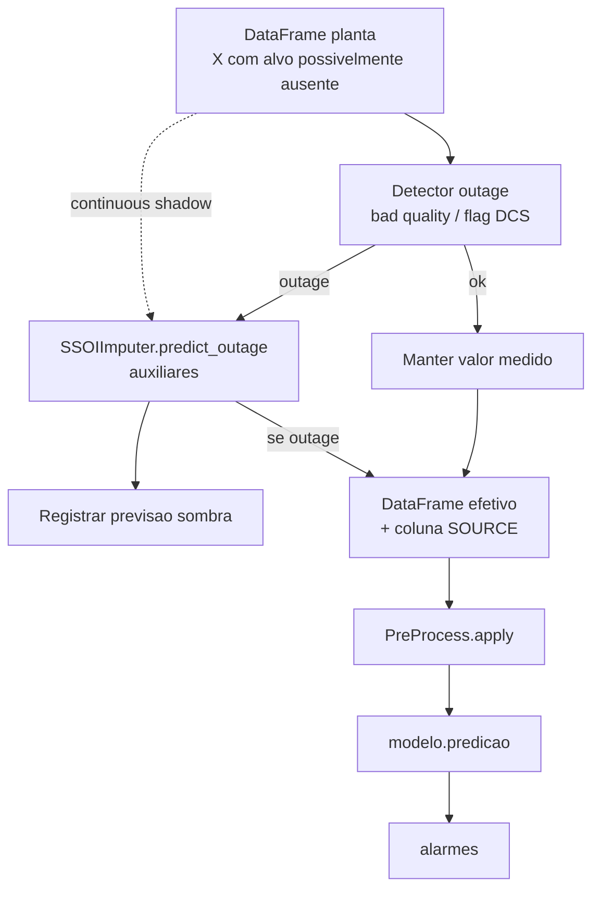
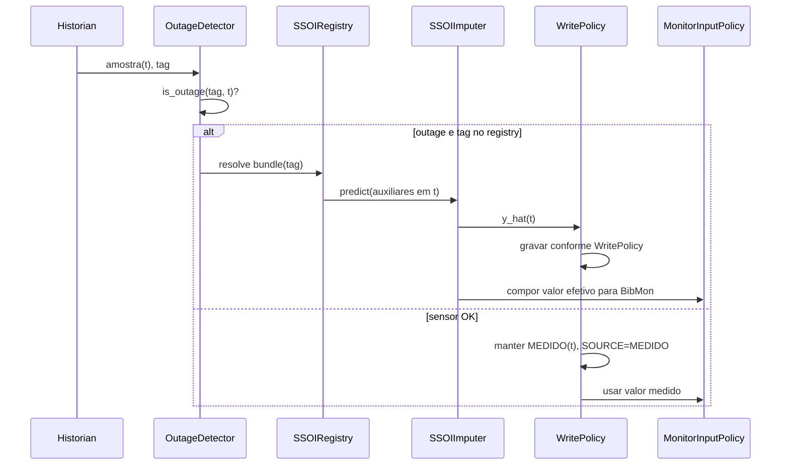
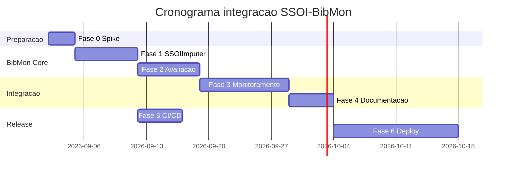

# Plano de Integracao SSOI na BibMon

Documento de planejamento (roadmap) para integrar o pacote
**single-sensor-outage-imputer** (SSOI / TCDR) ao ecossistema **BibMon**.

A **spec canonica** mora no repositorio hospedeiro:

- BibMon `doc/SSOI_BIBMON.md`
- BibMon `specs/001-ssoi-outage-integration/`
- BibMon `doc/adr/` e `doc/runbooks/`

Este arquivo permanece como narrativa de fases e cronograma. Em conflito, a spec
e as ADRs da BibMon prevalecem. O **andamento vivo** (fluxogramas, rascunhos,
decisoes ja tomadas no codigo) esta em BibMon `doc/SSOI_PLANO_VIVO.md` e deve
ser atualizado a cada implementacao.

| Campo            | Valor                                      |
|------------------|--------------------------------------------|
| Versao do plano  | 1.10                                       |
| Data             | 2026-09-08                                 |
| Repo SSOI        | single-sensor-outage-imputer               |
| Repo BibMon      | Grupo-EngePol/BibMon (branch `migration`)  |
| Spec canonica    | BibMon `doc/SSOI_BIBMON.md`                 |
| Andamento vivo   | BibMon `doc/SSOI_PLANO_VIVO.md`             |
| Treino/cadastro  | BibMon `doc/SSOI_PLANO_TREINO_E_CADASTRO.md` |
| Status           | Fase 1-3 minima no codigo (wrapper, detector, fio, reliability por tag) |

---

## 1. Objetivo

Permitir que a BibMon continue monitorando o processo quando um sensor
importante deixa de fornecer um valor confiavel.

Em termos simples:

1. Enquanto o sensor esta saudavel, a BibMon usa o valor medido.
2. Quando o sensor fica indisponivel, o detector confirma o outage.
3. O SSOI estima o valor usando sensores auxiliares que continuam online.
4. A BibMon usa o valor efetivo definido pela politica e continua calculando
   PCA, AE, SPE e alarmes.
5. Quando o sensor volta e permanece estavel, a BibMon retorna ao valor medido.

O modelo SSOI e treinado antes do deploy, usando dados historicos. A producao
nao treina automaticamente: ela carrega um bundle aprovado e executa apenas
inferencia.

### 1.1 O que o usuario ve no ciclo completo

- **Preparacao do modelo:** a equipe escolhe a tag, analisa os dados
  historicos, treina o TCDR e apresenta MAE, RMSE, R2 e demais evidencias.
- **Aprovacao:** o modelo aprovado e exportado como bundle versionado.
- **Instalacao:** a operacao instala uma imagem Docker ou um venv pinado com
  BibMon + SSOI e fornece a configuracao e os bundles.
- **Execucao:** um worker le novas amostras e chama o SSOI durante outages ou
  continuamente em sombra, conforme a configuracao.
- **Atualizacao:** um novo modelo e treinado fora da producao, validado em
  staging e ativado pela troca do apontador `current`.

### 1.2 Glossario rapido

- **Tag:** nome que identifica uma variavel da planta, como vazao ou pressao.
- **Sensor alvo:** tag que sera reconstruida quando ficar indisponivel.
- **Sensor auxiliar:** tag usada pelo modelo para estimar o sensor alvo.
- **Outage:** periodo em que o valor do sensor alvo nao pode ser usado.
- **Stale:** valor que nao foi atualizado dentro do tempo esperado.
- **EDA:** analise exploratoria usada para entender qualidade, relacoes e
  disponibilidade dos dados antes do treino.
- **TCDR:** modelo do SSOI que estima o alvo a partir dos sensores auxiliares.
- **PCA/AE:** modelos de monitoramento ja existentes na BibMon.
- **SPE:** medida de desvio usada pela BibMon para gerar alarmes.
- **Bundle:** pasta que contem pesos treinados, scalers, lista ordenada de
  features e metadados do modelo.
- **Historian:** sistema ou arquivo que armazena o historico das tags.
- **DCS:** sistema de controle distribuido que monitora e controla a planta.
- **OPC UA:** protocolo que pode transportar dados entre sistemas industriais.
  DCS e OPC UA nao sao equivalentes: DCS e um sistema; OPC UA e um protocolo.
- **Worker:** processo que le dados e executa o fluxo em cada ciclo ou janela.
- **Staging:** ambiente de validacao anterior a producao.
- **Shadow mode:** modo seguro que calcula e registra a previsao, mas nao
  substitui a medicao oficial nem escreve no DCS.
- **Continuous shadow:** modo em que o SSOI calcula previsoes mesmo com o
  sensor saudavel, permitindo comparar previsao e medicao sem substituir o
  valor oficial.
- **Downstream:** etapas posteriores ao SSOI, como PreProcess, modelo BibMon,
  SPE e alarmes.

## 2. Escopo

### 2.1 Dentro do escopo

- Wrapper `SSOIImputer` na BibMon (padrao `ImputeGAPImputer`)
- Extra opcional `pip install bibmon[ssoi]`
- Script de avaliacao offline (dados sulfatos / HDF5)
- Helper de outage antes do pipeline de monitoramento
- Notebook de exemplo e documentacao
- CI leve + CI full opcional
- Contrato de bundle versionado (artefato externo ao git)
- Contrato do worker/CLI para execucao por ciclo ou janela
- Promocao, ativacao e rollback de bundles em staging/producao
- Modo `continuous_shadow` para avaliacao continua sem substituir a medicao
- Metricas de regressao e comparacao de alarmes downstream em pipeline sombra

### 2.2 Fora do escopo (v1)

- Treino TCDR dentro da BibMon
- Passo generico `imputar_ssoi` no `PreProcess`
- Substituir ImputeGAP para imputacao generica de NaN
- Conector real com historian, DCS ou OPC UA; na v1 o worker recebe DataFrame
  ou usa adapter mock/arquivo
- Intervalo de confianca / incerteza na predicao
- Retreino automatico em producao
- EDA, treino ou selecao automatica de tags dentro da BibMon

## 3. Principio arquitetural

```text
SOFTWARE                      MODELO                    DADOS/CONFIG
--------------------          -------------------       -------------------
BibMon + SSOI                 bundle/TAG/vN             historian da planta
imagem Docker ou venv    +    pesos + scalers      +    production.yaml
versoes pinadas               features + manifest       nunca no git
```

Essas tres partes possuem ciclos de atualizacao diferentes:

- O software muda quando ha uma nova release da BibMon ou do SSOI.
- O modelo muda quando um novo bundle e treinado e aprovado.
- Os dados e valores operacionais mudam conforme a planta e o ambiente.

Os repos permanecem separados. A BibMon consome o SSOI como dependencia
opcional. Os bundles ficam fora do git e sao localizados pelo
`production.yaml`.

---

## 4. SSOI vs ImputeGAP na BibMon

| Aspecto              | ImputeGAP (`ImputeGAPImputer`) | SSOI (`SSOIImputer`)              |
|----------------------|-------------------------------|-----------------------------------|
| Problema             | NaN espalhados na matriz      | Sensor alvo indisponivel, auxiliares ok |
| Entrada              | DataFrame completo            | Auxiliares (ordem do bundle)      |
| Saida                | DataFrame mesma forma         | Coluna alvo reconstruida          |
| Artefato             | Algoritmo escolhido na hora   | Bundle treinado por tag           |
| Onde na BibMon       | `PreProcess` (passo 2)        | Antes de `ModeloGenerico` (passo 2b) |
| Treino               | Na hora ou pre-configurado    | Offline no repo SSOI              |

**Regra:** nao misturar semanticamente os dois na v1.

Em linguagem simples, ImputeGAP trata valores ausentes de forma generica. O
SSOI resolve um caso diferente: um sensor alvo especifico ficou indisponivel e
existe um modelo previamente treinado para reconstrui-lo. Por isso o SSOI nao
entra como mais um passo generico do `PreProcess`.

---

## 5. Fluxogramas

### 5.1 Fluxo macro da integracao



Leitura do fluxo:

1. O treinamento ocorre offline e termina em um bundle aprovado.
2. Em producao, o worker recebe uma amostra ou janela da planta.
3. Se nao ha outage, o valor medido segue para a BibMon.
4. Se ha outage, o SSOI carrega o bundle da tag e estima o valor.
5. Em `continuous_shadow`, o SSOI tambem estima quando o sensor esta saudavel.
6. A politica forma o valor efetivo usado pelo monitoramento.
7. A previsao pode ser guardada em uma coluna de sombra para auditoria.
8. O fluxo normal da BibMon continua com pre-processamento, modelo e alarmes.

### 5.2 Fluxo de desenvolvimento e deploy


### 5.3 Promocao de bundle



### 5.4 Uso online na BibMon (batch ou amostra)



---

## 6. Fases e subetapas

Legenda de status: `[ ]` pendente | `[~]` em andamento | `[x]` concluido

---

### Fase 0 -- Spike de compatibilidade

**Objetivo:** validar que SSOI + BibMon coexistem no mesmo ambiente Python.

**Repos:** workspace compartilhado + SSOI + BibMon

**Duracao estimada:** 2-3 dias

| ID   | Subetapa                                      | Entregavel                          | Criterio de aceite                    |
|------|-----------------------------------------------|-------------------------------------|---------------------------------------|
| 0.1  | Instalar Python 3.11+                         | venv funcional                      | `python --version` >= 3.11            |
| 0.2  | Executar `setup_venv.sh`                       | imports OK                          | sem ImportError                       |
| 0.3  | Script `examples/bibmon_integration_smoke.py`   | script executavel                 | gera bundle sintetico e prediz        |
| 0.4  | Obter bundle industrial completo fora do git   | `artifacts/bundle_target_a`       | sete arquivos obrigatorios presentes  |
| 0.5  | Testar bundle industrial pela API publica      | log de saida                      | shape, ordem e unidades corretas       |
| 0.6  | Documentar matriz Python/numpy/torch            | nota no plano ou README           | combinacoes suportadas registradas    |

**Dependencias:** nenhuma.

**Riscos:** BibMon exige numpy>=2.3.5; verificar compatibilidade com torch/ssoi.
O diretorio industrial local nao pode ser considerado bundle valido enquanto
faltarem `scaler_X.joblib`, `scaler_y.joblib` ou `best_model.pth`.

---

### Fase 1 -- Wrapper minimo `SSOIImputer`

**Status:** `[x]` no codigo BibMon (2026-09-03). Branch
`feat/ssoi-imputer-wrapper` no remoto. Sem merge em `main`.
Detalhe: BibMon `doc/SSOI_PLANO_VIVO.md`.

**Objetivo:** API publica e opcional na BibMon no padrao
`ImputeGAPImputer`, sem tornar SSOI obrigatorio para o core.

**Repo:** BibMon (branch `feat/ssoi-imputer-wrapper`)

**Duracao estimada:** 1 semana

| ID   | Subetapa                                      | Entregavel                          | Criterio de aceite                    |
|------|-----------------------------------------------|-------------------------------------|---------------------------------------|
| 1.1  | Criar `bibmon/_ssoi_imputer.py`               | classe `SSOIImputer`                | `[x]` delega para `VirtualSensor`     |
| 1.2  | Metodo `predict_outage(df_aux)`               | Series                              | `[x]` colunas = features do bundle    |
| 1.3  | Metodo `fill_target(df, target, outage_mask)` | DataFrame                           | `[x]` preenche so linhas com mask     |
| 1.4  | Propriedades `target_name`, `features`        | API publica                         | `[x]` testes unitarios                |
| 1.5  | `setup.py` -> `extras_require['ssoi']`        | metadata do extra                   | `[x]` dependencia declarada           |
| 1.6  | Export em `bibmon/__init__.py` (import tardio do SSOI) | API opcional               | `[x]` `import bibmon` sem SSOI        |
| 1.7  | `test/test_ssoi_imputer.py`                   | testes com mock                     | `[x]` 44 testes                       |
| 1.8  | Factory de bundle sintetico em `test/fixtures/` | bundle gerado em `tmp_path`        | `[ ]` CI full                         |
| 1.9  | `doc/SSOI_WRAPPER.md` + plano vivo            | doc usuario                         | `[x]` 2026-09-04                      |

**API alvo (referencia):**

```python
import bibmon

imputer = bibmon.SSOIImputer(bundle_dir="path/to/bundle")
y_hat = imputer.predict_outage(df_aux)
df_out = imputer.fill_target(df_planta, imputer.target_name, outage_mask=mask)
```

**Dependencias:** Fase 0 concluida. Na Fase 1, o workspace pode instalar SSOI
localmente antes da BibMon. A instalacao isolada por `bibmon[ssoi]` somente
vira criterio de release depois da definicao do canal na Fase 5.

**PR sugerido:** 1 PR focado, sem alterar `PreProcess` nem `ModeloGenerico`.

---

### Fase 2 -- Avaliacao offline (sulfatos)

**Status:** `[~]` script e relatorio de metricas em 2026-09-04
(`avaliacao_ssoi_sulfatos.py`, `doc/SSOI_ENSAIO_SULFATOS.md`). Limiar de
promocao e ambiente limpo ainda nao. Nao versionar H5 nem bundle industrial.

**Objetivo:** validar, pela API publica da BibMon, um bundle treinado no SSOI,
com benchmark reproduzivel que espelha `imputacao_sulfatos_relatorio.py`.

**Repo:** BibMon

**Duracao estimada:** 1 semana

| ID   | Subetapa                                      | Entregavel                          | Criterio de aceite                    |
|------|-----------------------------------------------|-------------------------------------|---------------------------------------|
| 2.0  | Receber candidato treinado e versionado no SSOI | bundle + metricas de treino       | contrato completo e origem registrada |
| 2.1  | `scripts/avaliacao_ssoi_sulfatos.py`          | script CLI                          | Feito: `--bundle` / `--bundle-dir` + env |
| 2.2  | Simular outage na coluna alvo (mascara)       | hold-out sobre alvo observado       | Feito: MAE/RMSE/R2 no relatorio       |
| 2.3  | Saida JSON + Markdown                         | `doc/RELATORIO_SSOI_SULFATOS.*`     | formato analogo ao ImputeGAP          |
| 2.4  | Comparacao opcional com 1-2 metodos ImputeGAP | tabela comparativa                  | documentada no relatorio              |
| 2.5  | Variaveis de ambiente (amostra, skip)         | compativel com padrao sulfatos      | `SULFATOS_MAX_ROWS` etc.              |
| 2.6  | Registrar origem do bundle e periodo dos dados | metadados no relatorio             | avaliacao auditavel                    |
| 2.7  | Avaliar previsao continua em periodo observado | metricas por janela/regime         | MAE/RMSE/R2/bias/percentis reportados |

**Dependencias:** Fase 1 + HDF5 sulfatos local (fora do git) + bundle candidato
gerado pelo pipeline offline do SSOI.

**Criterio de promocao de bundle:** metricas de outage-mode no hold-out dentro
de limiar acordado pelo time (definir na revisao do relatorio).

**Limite:** esta fase nao treina TCDR dentro da BibMon. EDA, selecao de
features e treino continuam no SSOI; a BibMon valida o artefato consumido.

---

### Fase 3 -- Integracao com monitoramento BibMon

**Objetivo:** usar SSOI no fluxo real quando o alvo cai e avaliar continuamente
o modelo e seu impacto downstream sem substituir a medicao saudavel.

**Repo:** BibMon

**Duracao estimada:** 2 semanas

| ID   | Subetapa                                      | Entregavel                          | Criterio de aceite                    |
|------|-----------------------------------------------|-------------------------------------|---------------------------------------|
| 3.1  | `bibmon/_outage_detector.py`                  | `OutageConfig` + `OutageDetector`   | Feito na branch `feat/ssoi-imputer-wrapper` (NaN/stale + histerese) |
| 3.2  | `bibmon/_ssoi_registry.py`                    | `SSOIRegistry`                      | Feito na branch `feat/ssoi-imputer-wrapper` |
| 3.3  | Coluna opcional `{target}_SOURCE`             | rastreabilidade                     | SSOI vs MEDIDO                        |
| 3.4  | Atualizar `monitoramento_processo_real.ipynb` | notebook                            | cenario outage demonstrado            |
| 3.5  | Validar SPE/alarmes com e sem outage          | nota tecnica curta                  | alarmes nao disparam por NaN no alvo |
| 3.6  | `bibmon/_outage_recovery.py`                  | `apply_outage_imputation()`         | Feito: testes unitarios sem I/O industrial |
| 3.7  | Separar escrita e entrada do monitoramento    | `MonitorInputPolicy`                | shadow nao altera DCS por acidente    |
| 3.8  | Modo `shadow_mode` (imputa mas nao publica)   | flag em config                      | util para staging                     |
| 3.9  | Testes batch, amostra e modos de inferencia   | testes unitarios/integracao         | indices, masks e fontes preservados   |
| 3.10 | Modos `outage_only` e `continuous_shadow`     | `InferenceMode`                    | previsao saudavel nunca vira oficial  |
| 3.11 | Pipeline downstream paralelo                  | alarmes oficiais e sombra          | divergencias registradas por evento   |
| 3.12 | Metricas downstream com labels opcionais      | precision/recall/F1/PR-AUC/FPR     | sem labels nao reporta falso positivo |

**Ponto de integracao (nao no PreProcess):**

```python
df_out = bibmon.apply_outage_imputation(
    df,
    registry,
    detector,
    write_policy=bibmon.WritePolicy.SHADOW_COLUMN,
    monitor_input_policy=bibmon.MonitorInputPolicy.EFFECTIVE,
    inference_mode=bibmon.InferenceMode.CONTINUOUS_SHADOW,
    shadow_mode=True,
)
modelo.predict(df_out.effective_data)
```

**Dependencias:** Fase 1 para desenvolvimento. Fase 2 aprovada antes de
qualquer staging com bundle industrial.

---

### Fase 4 -- Documentacao e exemplos

**Objetivo:** usuario BibMon sabe quando e como usar SSOI.

**Repo:** BibMon (+ link deste plano no SSOI)

**Duracao estimada:** 3-5 dias

| ID   | Subetapa                                      | Entregavel                          | Criterio de aceite                    |
|------|-----------------------------------------------|-------------------------------------|---------------------------------------|
| 4.1  | `bibmon/exemplos/imputacao_ssoi_outage.ipynb` | notebook                            | executa de ponta a ponta               |
| 4.2  | Secao no `README.md` BibMon                   | analogo a secao ImputeGAP           | revisado                              |
| 4.3  | Tabela decisao SSOI vs ImputeGAP              | em `doc/SSOI_BIBMON.md`             | aprovado pelo time                    |
| 4.4  | Atualizar `guia_de_desenvolvimento.md`        | nota sobre imputadores externos     | menciona padrao wrapper               |
| 4.5  | Documentar avaliacao continua e downstream    | secao de metricas                   | distingue regressao de classificacao  |

**Dependencias:** Fases 1 e 3.

---

### Fase 5 -- CI/CD e releases

**Objetivo:** instalacao e deploy previsiveis.

**Repos:** SSOI + BibMon

**Duracao estimada:** 3-5 dias

| ID   | Subetapa                                      | Entregavel                          | Criterio de aceite                    |
|------|-----------------------------------------------|-------------------------------------|---------------------------------------|
| 5.1  | SSOI: tag release `v0.1.x`                    | GitHub release                      | wheel/sdist no canal usado pela BibMon |
| 5.2  | BibMon extra `[ssoi]` pinado na versao SSOI   | setup.py atualizado                 | install reproduzivel                  |
| 5.3  | CI leve BibMon: testes com mock               | `ci.yml` verde                      | sem torch/SSOI no job padrao          |
| 5.4  | CI full manual: `ci-full` com `[ssoi]`        | workflow manual                     | smoke com bundle fixture              |
| 5.5  | `requirements-lock` ou secao no doc de deploy | versoes pinadas                     | documentado                           |
| 5.6  | Definir canal oficial do pacote SSOI          | URL/registry documentado            | `pip install "bibmon[ssoi]"` sem clone |
| 5.7  | Testar contrato e integridade no SSOI         | testes de bundle                    | schema/checksum incompativel falha    |

**Dependencias:** pode iniciar apos a Fase 1. A release integrada da BibMon
somente fecha depois das Fases 3 e 4.

---

### Fase 6 -- Deploy operacional

**Objetivo:** producao na planta ou servidor de monitoramento.

**Local:** infraestrutura operacional (fora dos repos)

**Duracao estimada:** preparacao em paralelo apos Fase 3; promocao apos Fase 5

| ID   | Subetapa                                      | Entregavel                          | Criterio de aceite                    |
|------|-----------------------------------------------|-------------------------------------|---------------------------------------|
| 6.1  | Layout `/bundles/TAG/vN` + `current -> vN`    | storage                             | troca atomica do apontador            |
| 6.2  | `config/production.yaml`                      | bundle_root, targets, shadow_mode   | revisado por operacao                 |
| 6.3  | Imagem Docker ou venv pinado                  | artefato deploy                     | mesmo ambiente staging/prod           |
| 6.4  | Logging: bundle_version, latency, target      | logs estruturados                   | auditoria possivel                    |
| 6.5  | Runbook de rollback (bundle e imagem)         | doc operacao                        | testado em staging                    |
| 6.6  | Shadow mode em staging por N semanas          | relatorio operacional               | antes de qualquer publicacao oficial  |
| 6.7  | Worker/CLI operacional                        | ponto de entrada executavel         | processa ciclo/janela com adapter mock |
| 6.8  | Validacao de bundle antes da ativacao         | checksum + schema + smoke           | bundle invalido nunca vira `current`  |
| 6.9  | Guia de instalacao Docker/venv                | `doc/DEPLOY_SSOI_BIBMON.md`         | instalacao limpa reproduzida          |
| 6.10 | Retencao de previsoes e alarmes sombra        | storage + politica de amostragem    | custo e prazo de retencao aprovados   |

**Dependencias:** Fases 1 a 5 concluidas para producao. A preparacao da
infraestrutura pode ocorrer em paralelo apos a Fase 3.

### Gates entre fases

Uma fase pode iniciar parcialmente em paralelo, mas nao pode promover seu
artefato sem o gate anterior aplicavel:

| Gate | Condicao de saida | Libera |
|------|-------------------|--------|
| G0 Compatibilidade | Python/numpy/torch validados; smoke sintetico e industrial passam | Fase 1 |
| G1 API | wrapper opcional, import tardio e testes leves passam | Fase 2 e inicio da Fase 5 |
| G2 Bundle | metricas outage e continuas do candidato aprovadas | staging da Fase 3 |
| G3 Runtime | detector, registry, politicas e pipelines oficial/sombra testados | Fase 4 e preparacao da Fase 6 |
| G4 Documentacao | uso, limites e decisoes explicados | release integrada |
| G5 Release | wheels, lock, CI full e imagem/venv reproduziveis | staging operacional |
| G6 Staging | continuous shadow, estado, latencia e rollback validados | producao |

---

## 7. Registro de decisoes operacionais

Nem todas as decisoes precisam estar fechadas antes da Fase 1. Porem **devem
estar mapeadas** neste plano e **ter ganchos no codigo** (config/protocolos)
desde cedo, para nao acoplar politica de planta ao nucleo do SSOI.

### 7.1 Principio

```text
SSOI (repo)     = predicao pontual: predict(x_t) -> y_hat(t)
BibMon (repo)   = politica: quando, qual bundle, onde gravar, o que fazer ao voltar
Operacao        = valores finais em production.yaml (decisao humana)
```

- **Decidir antes de producao (Fase 6):** sim, todas as linhas da tabela abaixo.
- **Bloquear Fase 1:** nao -- usar defaults documentados e interfaces extensiveis.
- **Bloquear Fase 3:** sim -- decisoes D1, D1b, D3, D4, D4b, D5 e D11 pelo menos em rascunho.

### 7.2 Tabela de decisoes (ADRs operacionais)

| ID | Decisao | Opcoes | Default v1 (recomendado) | Fase para fechar | Gancho no codigo |
|----|---------|--------|--------------------------|------------------|------------------|
| **D1** | Como detectar outage? | NaN, bad quality, stale, flag DCS, combinacao | NaN **ou** stale > 120s | Fase 3 / 6 | `OutageDetector` (protocolo/callable) |
| **D1b** | Parametros de tempo de falha | ver secao 7.2.1 | defaults globais + override por tag | Fase 3 / 6 | `OutageConfig` + YAML `outage:` |
| **D2** | Quantos alvos cobertos? | 1, N criticos, todos | N criticos com bundle treinado | Fase 2 / 6 | `SSOIRegistry` (YAML + dict) |
| **D3** | Granularidade temporal | online (1 amostra/ciclo), batch (janela), backfill historico | online por ciclo | Fase 3 | `apply_outage_imputation(mode=...)` |
| **D4** | Onde gravar/publicar imputacao? | coluna sombra, sobrescrever alvo, so log | coluna sombra `{tag}_SSOI` | Fase 3 / 6 | `WritePolicy` enum |
| **D4b** | Qual valor alimenta o monitoramento? | somente medido, efetivo medido/SSOI, somente sombra | efetivo: MEDIDO se saudavel, SSOI se outage | Fase 3 / 6 | `MonitorInputPolicy` |
| **D5** | Sensor volta -- o que fazer? | real substitui imediato, hysteresis, manter sombra | `recovery_seconds` (ex.: 60s) antes de MEDIDO | Fase 3 | `outage_mask` + `OutageConfig` |
| **D6** | Historico imputado na falha? | manter + SOURCE, reconciliar, apagar | manter com `SOURCE=SSOI` | Fase 6 | coluna `{tag}_SOURCE` |
| **D7** | Alvo sem bundle em falha? | alarme, ImputeGAP, ultimo valor, ignorar | alarme + nao imputar | Fase 3 | `registry.get(tag)` -> None |
| **D8** | Multifalha simultanea? | loop independente por tag | uma instancia `VirtualSensor` por tag | Fase 1 / 3 | `dict[str, SSOIImputer]` |
| **D9** | Modo staging vs prod? | shadow obrigatorio, publicacao aprovada | shadow em staging; producao segue D4 | Fase 6 | `shadow_mode: bool` no YAML |
| **D10** | Cadencia do job | 1 min, 5 min, evento OPC | alinhado ao historian | Fase 6 | fora do BibMon (orquestrador) |
| **D11** | Quando executar inferencia? | `outage_only`, `continuous_shadow` | `continuous_shadow` em staging; decidir custo em producao | Fase 3 / 6 | `InferenceMode` + YAML `inference.mode` |

Cada decisao fechada deve gerar uma linha no `config/production.yaml` e, se
relevante, uma nota de 3-5 linhas em `doc/SSOI_BIBMON.md` (secao Operacao).

### 7.2.1 Parametros de tempo de falha (D1b)

A **duracao real** de uma falha (ex.: 10 min) nao e parametro do SSOI -- e o
evento na planta. O que se parametriza e **quando declarar outage**, **quando
ligar o SSOI** e **quando voltar ao valor medido**.

| Parametro | Tipo | Default v1 | Descricao |
|-----------|------|------------|-----------|
| `stale_seconds` | int | 120 | Sem amostra nova ha N segundos -> falha bruta (stale) |
| `min_outage_seconds` | int | 30 | So aciona SSOI apos N s de falha (anti-flapping) |
| `recovery_seconds` | int | 60 | Sensor OK por N s antes de voltar a `SOURCE=MEDIDO` (histerese) |
| `max_consecutive_nan` | int | 2 | N NaNs consecutivos -> falha bruta (regra `nan`) |
| `rules` | list[str] | `[nan, stale]` | Regras ativas: `nan`, `stale`, `bad_quality`, `dcs_flag` |

**Escopo de configuracao:**

- **Global:** bloco `outage:` em `production.yaml` (defaults para todas as tags).
- **Por tag:** bloco `targets.<tag>.outage:` sobrescreve apenas os campos
  definidos (ex.: FIT mais tolerante com `stale_seconds: 180`).

**Exemplo temporal (defaults acima):**

```text
10:00  FIT ok
10:01  FIT stale (60s)     -> falha bruta, mas SSOI ainda OFF (min_outage=30 nao atingido em batch curto)
10:02  FIT stale (120s)    -> outage confirmado -> SSOI ON
10:03..10:12               -> SSOI a cada ciclo (falha real de ~10 min)
10:13  FIT 1 amostra ok    -> SSOI ainda ON (recovery_seconds nao cumprido)
10:14  FIT ok ha 60s+       -> SOURCE=MEDIDO, SSOI OFF
```

**Implementacao:** classe `OutageConfig` (dataclass) lida pelo `OutageDetector`.
O SSOI recebe apenas `outage_mask` por timestamp -- nao interpreta tempos.

| Fase | Entregavel D1b |
|------|----------------|
| 1 | nenhum; wrapper recebe `outage_mask` pronto |
| 3 | `OutageDetector` com `min_outage_seconds` e `recovery_seconds` |
| 6 | Valores finais no YAML + overrides por tag validados em staging |

### 7.2.2 Tres decisoes que nao devem ser confundidas

Quando o SSOI gera uma previsao, ainda existem tres perguntas diferentes:

1. **Qual valor a BibMon deve usar?**
   `MonitorInputPolicy` responde essa pergunta. O default `effective` usa o
   valor medido quando o sensor esta saudavel e a previsao SSOI quando o
   outage esta confirmado.

2. **Onde a previsao deve ser guardada?**
   `WritePolicy` responde essa pergunta. O default grava em uma coluna de
   sombra, como `{tag}_SSOI`, sem substituir a coluna oficial.

3. **A publicacao externa esta autorizada?**
   `shadow_mode` funciona como trava de seguranca. Quando esta ativo, nenhuma
   previsao pode ser escrita no DCS, mesmo que outra configuracao solicite
   sobrescrita.

Exemplo:

```text
Sensor saudavel:
  valor oficial = medido
  valor efetivo da BibMon = medido
  SOURCE = MEDIDO

Sensor em outage confirmado:
  valor oficial = permanece inalterado
  coluna de sombra = previsao SSOI
  valor efetivo da BibMon = previsao SSOI
  SOURCE = SSOI
```

Assim, alimentar internamente o monitoramento com SSOI nao significa escrever
a previsao de volta no sistema de controle.

`continuous_shadow` tambem nao significa substituir sempre o sensor. Ele
significa apenas calcular e registrar uma previsao paralela. O
`OutageDetector` continua sendo responsavel por autorizar o uso do SSOI como
valor efetivo.

### 7.3 Fluxo temporal (decisoes D3, D4, D4b, D5, D1b)



**Horizonte de predicao (esclarecimento):** SSOI preve **um instante por chamada**
(condicional aos auxiliares naquele `t`). Falha de 10 min com amostra 1 min =
10 predicoes (10 ciclos ou 1 batch de 10 linhas), nao um unico horizonte
autoregressivo.

### 7.4 Caminhos no codigo (o que implementar e onde)

| Componente | Repo | Arquivo (previsto) | Responsabilidade |
|------------|------|--------------------|------------------|
| `VirtualSensor` | SSOI | `ssoi/predict.py` | so `predict()` -- **sem politica** |
| `SSOIImputer` | BibMon | `bibmon/_ssoi_imputer.py` | wrapper fino sobre VirtualSensor |
| `OutageDetector` | BibMon | `bibmon/_outage_detector.py` | D1, D1b: protocolo + tempos parametrizaveis |
| `OutageConfig` | BibMon | `bibmon/_outage_detector.py` | D1b: defaults e override por tag |
| `SSOIRegistry` | BibMon | `bibmon/_ssoi_registry.py` | D2, D7, D8: tag -> bundle, enabled |
| `WritePolicy` | BibMon | `bibmon/_outage_recovery.py` | D4, D6: destino externo da predicao |
| `MonitorInputPolicy` | BibMon | `bibmon/_outage_recovery.py` | D4b: valor efetivo entregue ao monitoramento |
| `InferenceMode` | BibMon | `bibmon/_outage_recovery.py` | D11: outage only ou previsao continua |
| `apply_outage_imputation` | BibMon | `bibmon/_outage_recovery.py` | orquestra D1-D11 em batch/online |
| Config YAML | BibMon | `config/production.yaml` (exemplo) | D9-D11: valores por ambiente |
| Exemplo operacao | BibMon | `bibmon/exemplos/imputacao_ssoi_outage.ipynb` | demonstra defaults |

**SSOI nao deve** importar BibMon nem ler YAML de planta. Toda politica fica
acima de `VirtualSensor`.

### 7.5 Contratos de API planejados (referencia para Fase 1/3)

As assinaturas abaixo sao contratos de planejamento, nao implementacao Python:

```text
OutageConfig
  stale_seconds: int = 120
  min_outage_seconds: int = 30
  recovery_seconds: int = 60
  max_consecutive_nan: int = 2
  rules: tuple[str, ...] = ("nan", "stale")

OutageDetector
  is_outage(tag: str, row: Series, ts: datetime) -> bool

WritePolicy
  SHADOW_COLUMN = "shadow"
  OVERWRITE_TARGET = "overwrite"
  LOG_ONLY = "log_only"

MonitorInputPolicy
  MEASURED_ONLY = "measured_only"
  EFFECTIVE = "effective"
  SHADOW_ONLY = "shadow_only"

InferenceMode
  OUTAGE_ONLY = "outage_only"
  CONTINUOUS_SHADOW = "continuous_shadow"

apply_outage_imputation(
  df: DataFrame,
  registry: SSOIRegistry,
  detector: OutageDetector,
  write_policy: WritePolicy = SHADOW_COLUMN,
  monitor_input_policy: MonitorInputPolicy = EFFECTIVE,
  inference_mode: InferenceMode = OUTAGE_ONLY,
  shadow_mode: bool = false
) -> OutageImputationResult

OutageImputationResult
  effective_data: DataFrame
  published_data: DataFrame
  source_data: DataFrame
  shadow_predictions: DataFrame
```

```yaml
# config/production.yaml (exemplo -- decisoes D1-D11, D1b e D4b)
environment: production
outage:
  stale_seconds: 120
  min_outage_seconds: 30
  recovery_seconds: 60
  max_consecutive_nan: 2
  rules: [nan, stale]
write_policy: shadow_column
monitor_input_policy: effective
shadow_mode: false
inference:
  mode: outage_only
  downstream_shadow: false
  metrics_window_rows: 1440
execution:
  mode: online_cycle
  cadence_seconds: 60
targets:
  1251_FIT_801C_2:
    bundle: bundles/fit_801c_2/current
    enabled: true
    outage:
      stale_seconds: 180    # override D1b: FIT mais tolerante
  1251_PIT_802A:
    bundle: bundles/pit_802a/current
    enabled: true
    # sem bloco outage -> herda defaults globais
```

Em staging, sobrescrever apenas:

```yaml
environment: staging
shadow_mode: true
inference:
  mode: continuous_shadow
  downstream_shadow: true
```

### 7.6 O que fechar em cada fase

| Fase | Decisoes | Acao |
|------|----------|------|
| 0-1 | D8 (multifalha = dict) | `SSOIImputer` stateless por tag |
| 2 | D2 (quais alvos treinar primeiro) | lista de tags no script sulfatos |
| 3 | D1, D1b, D3, D4, D4b, D5, D7, D11 | detector, escrita, entrada e modo de inferencia; revisar com time |
| 4 | documentar D1-D11 e D4b | secao Operacao em `SSOI_BIBMON.md` |
| 6 | D6, D9, D10, D11 | `production.yaml` aprovado por operacao |

### 7.7 Checklist de decisoes (antes de producao)

- [ ] D1: regra de outage documentada por classe de instrumento
- [ ] D1b: `stale_seconds`, `min_outage_seconds`, `recovery_seconds` definidos
      globalmente e overrides por tag (se necessario) validados em staging
- [ ] D2: lista de tags com bundle aprovado
- [ ] D3: online vs batch definido
- [ ] D4: politica de escrita (sombra vs overwrite)
- [ ] D4b: valor efetivo que alimenta o monitoramento definido
- [ ] D5: comportamento ao retorno do sensor validado em staging
- [ ] D6: politica de retencao do historico imputado
- [ ] D7: fallback para tag sem bundle
- [ ] D8: registry carregado no startup testado com multifalha simulada
- [ ] D9: shadow_mode testado em staging
- [ ] D10: cadencia do job alinhada ao historian
- [ ] D11: `outage_only` vs `continuous_shadow` e custo definidos por ambiente

### 7.8 Camadas de execucao e limites da integracao

O fluxograma da Secao 5.1 mostra o caminho completo. Esta secao esclarece
quem e responsavel por cada parte. As tres camadas fazem parte da solucao, mas
nao devem virar um unico programa:

- A Camada 1 prepara e aprova o modelo.
- A Camada 2 aplica a regra de outage e integra a previsao com a BibMon.
- A Camada 3 conecta essa logica ao ambiente operacional.

Essa separacao permite atualizar um bundle sem alterar a BibMon e atualizar a
BibMon sem treinar novamente todos os modelos.

#### Camada 1 -- treino e validacao offline

- Executada no repo SSOI ou em pipeline de pesquisa controlado.
- Recebe dados historicos autorizados.
- Executa EDA, selecao de features, treino e avaliacao hold-out.
- Exibe MAE, RMSE, R2, cobertura, periodo de treino e versao dos dados.
- Produz um bundle imutavel por alvo e versao.
- Nao executa dentro do worker de inferencia em producao na v1.

#### Camada 2 -- integracao SSOI-BibMon

- Implementada na BibMon por `SSOIImputer`, `OutageDetector`,
  `SSOIRegistry`, `WritePolicy` e `apply_outage_imputation`.
- Decide quando uma tag esta em outage e qual bundle deve ser usado.
- Executa inferencia, registra a origem do valor e entrega o DataFrame ao
  fluxo existente de `PreProcess`, modelo e alarmes.
- Nao conhece detalhes de OPC-UA, DCS, agenda ou credenciais de planta.

#### Camada 3 -- orquestracao operacional

- Executada por um worker/CLI ou servico externo ao nucleo da BibMon.
- Le dados do historian ou gateway autorizado, chama a Camada 2 e publica
  resultados conforme a politica operacional.
- Define agenda, conectores, retentativas, observabilidade e persistencia do
  estado temporal do detector.
- Integracao direta com DCS/OPC-UA continua fora do escopo da v1, mas o
  contrato de entrada e saida do worker deve permitir um conector futuro.

Portanto, EDA e treino pertencem ao ciclo de vida da solucao, mas nao ao
runtime da integracao. A deteccao de outage e a chamada do SSOI pertencem a
integracao. A forma de disparo e a comunicacao com a planta pertencem a
orquestracao operacional.

### 7.9 Formas de execucao do worker

As tres formas abaixo usam a mesma API da Camada 2. O que muda e apenas o
gatilho e o tamanho do DataFrame recebido.

| Modo | Gatilho | Entrada | Uso recomendado |
|------|---------|---------|-----------------|
| Online por ciclo | agenda alinhada ao historian | uma amostra ou janela curta | producao v1 |
| Batch por janela | agenda periodica | janela com N timestamps | avaliacao, backfill e menor frequencia |
| Orientado a evento | evento de qualidade/stale | tag e contexto atual | somente se a infraestrutura ja fornecer eventos confiaveis |

**Default recomendado para a v1:** online por ciclo. E o melhor custo-beneficio
porque funciona com historian consultado periodicamente, preserva a logica de
tempo do `OutageDetector` e nao exige uma infraestrutura de eventos.

Exemplo de um ciclo:

```text
1. Worker le a nova amostra ou janela.
2. OutageDetector atualiza o estado por tag.
3. SSOIRegistry resolve o bundle ativo.
4. Em outage_only, SSOIImputer preve somente as linhas em outage.
5. Em continuous_shadow, SSOIImputer preve todas as linhas validas.
6. OutageDetector decide se a previsao pode virar valor efetivo.
7. WritePolicy define onde a predicao pode ser publicada.
8. MonitorInputPolicy compoe o valor efetivo entregue ao monitoramento.
9. BibMon executa PreProcess, modelo, SPE e alarmes.
10. Worker persiste estado e emite logs/metricas.
```

O estado necessario para `min_outage_seconds` e `recovery_seconds` deve
sobreviver a reinicios. Na v1, o worker pode reconstruir esse estado lendo uma
janela recente do historian no startup. Se isso nao for possivel, deve usar
storage local persistente e documentar a politica de recuperacao.

### 7.10 Empacotamento e ciclo de vida do modelo em producao

#### Desenvolvimento

O venv compartilhado na raiz deste workspace instala os dois repos com
`pip install -e`. Ele serve apenas para desenvolvimento e para o spike da
Fase 0.

#### Producao

A producao recebe um unico ambiente executavel contendo BibMon e a dependencia
opcional SSOI:

```text
pip install "bibmon[ssoi]"
```

O SSOI deve ser disponibilizado pelo mesmo mecanismo usado para outras
dependencias opcionais da BibMon. O canal exato (indice privado, release com
wheel ou URL versionada) deve ser definido na Fase 5 e fixado no lock de
dependencias. A producao nao deve depender de dois clones locais nem usar
instalacao editavel.

Existem dois formatos de deploy suportados:

| Formato | Quando usar | Observacao |
|---------|-------------|------------|
| Imagem Docker pinada | ambiente com runtime de containers | recomendado quando disponivel; maior reproducibilidade |
| Venv pinado | host controlado sem plataforma de containers | aceitavel se Python, SO e lock forem iguais em staging/prod |

#### O que o usuario final instala

Com Docker, o usuario final nao instala Python, torch, BibMon ou SSOI
separadamente. Ele recebe:

1. o nome e a versao da imagem;
2. um `production.yaml` revisado;
3. os bundles aprovados;
4. instrucoes para montar config, bundles, estado e logs;
5. um comando ou arquivo de servico para iniciar o worker.

Na pratica, o host baixa a imagem, monta os diretorios externos e inicia o
container. Atualizar o software significa trocar a tag da imagem. Atualizar o
modelo significa publicar um novo bundle e alterar `current`.

Com venv, um instalador controlado cria o ambiente, instala as versoes do lock
e registra o worker como servico. O usuario final tambem nao deve editar o
venv manualmente.

No formato Docker, a imagem contem codigo e dependencias, mas nao contem
bundles de producao, `production.yaml`, dados da planta ou credenciais. Esses
itens sao montados ou injetados no container em runtime.

```text
IMAGEM                           VOLUMES/CONFIG EXTERNOS
bibmon + ssoi + torch           /config/production.yaml
worker/CLI                      /bundles/TAG/current
dependencias pinadas            /state
                                /logs
```

#### Bundle ja treinado

O modelo chega a producao como bundle; nenhum treino ocorre no worker:

```text
/bundles/
  1251_FIT_801C_2/
    v1/
      manifest.json
      feature_selection_config.json
      train_feature_means.json
      scaler_X.joblib
      scaler_y.joblib
      model_config.json
      best_model.pth
    v2/
      ...
    current -> v2
```

O apontador `current` fica no nivel da tag. As pastas `v1`, `v2` e seguintes
sao imutaveis. Alterar um bundle existente e proibido; uma mudanca sempre gera
uma nova versao.

#### Startup do worker

```text
1. Ler e validar production.yaml.
2. Resolver current para cada tag habilitada.
3. Validar arquivos obrigatorios, checksum e schema_version.
4. Carregar os bundles e executar um smoke local.
5. Reconstruir ou carregar o estado do OutageDetector.
6. Iniciar ciclos de leitura e inferencia.
```

Se qualquer bundle obrigatorio falhar, o worker nao deve iniciar em modo de
publicacao. Em shadow mode, a politica de degradacao deve ser explicita e
registrada.

#### Promocao e atualizacao

```text
1. Treinar e avaliar o candidato fora da producao.
2. Publicar o bundle como TAG/vN+1 sem alterar current.
3. Validar checksum, contrato de features, schema e smoke de inferencia.
4. Executar em staging com shadow_mode=true.
5. Aprovar as metricas offline e operacionais.
6. Trocar current de vN para vN+1 de forma atomica.
7. Reiniciar o worker de forma controlada.
8. Confirmar bundle_version, latencia e saude nos logs.
```

**Default recomendado para a v1:** troca atomica de `current` seguida de
restart controlado. Hot reload fica fora da v1 porque exige sincronizacao entre
requisicoes, fallback em memoria e tratamento de carga parcial.

#### Rollback

Rollback de modelo e rollback de codigo sao independentes:

```text
Bundle ruim: current -> versao anterior; reiniciar worker.
Codigo ruim: voltar a tag anterior da imagem/venv; manter bundle compativel.
```

O manifest deve registrar, no minimo, `schema_version`, `target_name`,
features ordenadas, versao do pacote SSOI, identificador dos dados de treino,
metricas aprovadas e checksum dos arquivos. A matriz de compatibilidade entre
versao BibMon, versao SSOI e schema do bundle deve constar no documento de
deploy.

#### Semantica de shadow mode

Na v1, `shadow_mode=true` significa:

- calcular a predicao SSOI conforme `inference.mode`;
- registrar valor, fonte, bundle e latencia;
- permitir gravacao apenas em coluna ou storage de sombra;
- nao sobrescrever a medicao oficial;
- nao escrever no DCS.

Por default, `monitor_input_policy=effective`: o monitoramento recebe MEDIDO
quando o sensor esta saudavel e SSOI quando o outage esta confirmado. Isso nao
autoriza escrita no DCS. Publicar externamente (`WritePolicy`) e alimentar
internamente a BibMon (`MonitorInputPolicy`) sao decisoes independentes.

### 7.11 Avaliacao continua e impacto downstream

#### Objetivo

O modo `continuous_shadow` permite verificar o desempenho do bundle enquanto o
sensor esta saudavel. O SSOI calcula uma previsao em paralelo, mas o valor
medido continua sendo a referencia oficial.

```text
Sensores auxiliares -> SSOI -> previsao sombra -----+
                                                     +-> metricas de regressao
Sensor alvo saudavel -------> valor medido ---------+

Valor medido -> pipeline BibMon oficial -> alarmes oficiais
Previsao SSOI -> pipeline BibMon sombra -> alarmes sombra
```

#### Metricas de regressao

Quando existe medicao valida do alvo, registrar pelo menos:

- MAE;
- RMSE;
- R2;
- bias medio;
- erro absoluto mediano;
- percentis P90, P95 e P99 do erro absoluto;
- metricas por janela temporal e regime operacional;
- disponibilidade dos sensores auxiliares;
- versao do bundle e periodo avaliado.

As metricas devem usar dados posteriores ao periodo de treino ou um periodo
hold-out bloqueado no tempo. Pontos com qualidade ruim no sensor de referencia
nao podem ser tratados como verdade confiavel.

Durante um outage real nao existe verdade observada online. A qualidade desse
trecho somente pode ser avaliada se houver reconciliacao posterior, sensor
redundante confiavel ou outra referencia aprovada.

#### Metricas de alarmes downstream

Para medir o impacto no monitoramento, executar dois pipelines em paralelo:

1. **Pipeline oficial:** usa a medicao saudavel.
2. **Pipeline sombra:** usa a previsao SSOI no lugar do alvo.

Registrar SPE, estado dos alarmes, inicio/fim de cada evento e divergencias
entre os dois pipelines.

Accuracy, precision, recall, F1, taxa de falsos positivos e PR-AUC somente
podem ser chamados de metricas de classificacao quando existe uma referencia
de eventos ou falhas rotuladas. Sem labels confiaveis, o relatorio deve usar
termos como `divergencia`, `alarme somente oficial` e
`alarme somente sombra`; nao deve classificar automaticamente essas diferencas
como falsos positivos ou falsos negativos. Para eventos raros, PR-AUC,
precision e recall sao mais informativos que accuracy isolada.

As metricas de alarme devem ser calculadas preferencialmente por evento, e nao
apenas por amostra, para que um alarme longo nao seja contado como centenas de
acertos ou erros independentes.

#### Criterios operacionais

- `continuous_shadow` e obrigatorio durante a validacao em staging.
- Em producao, seu uso continuo depende de custo de CPU, latencia e retencao.
- Se o custo for relevante, a operacao pode usar amostragem temporal sem
  alterar o modo `outage_only` usado para recuperacao.
- Previsao sombra nunca substitui a medicao saudavel.
- Falha no pipeline sombra nao pode interromper o pipeline oficial.
- Limiares de promocao devem ser definidos antes de aprovar cada bundle.

Os comandos de instalacao, operacao, verificacao e rollback devem ser
detalhados posteriormente em `doc/DEPLOY_SSOI_BIBMON.md` e
`doc/RUNBOOK_SSOI_BIBMON.md`. Este plano registra a arquitetura e os criterios
de aceite.

---

## 8. Cronograma sugerido

```text
Semana 1     | Fase 0 + inicio Fase 1
Semana 2     | Fase 1 (PR merge) + Fase 2 + inicio Fase 5
Semana 3     | Fechar Fase 2 + iniciar Fase 3
Semana 4     | Fechar Fase 3 + Fase 4 + fechar Fase 5
Semana 5     | Preparar infraestrutura e staging
Semana 6+    | Fase 6 (shadow staging -> producao)
```



---

## 9. Responsabilidades (RACI simplificado)

| Atividade              | Dev SSOI | Dev BibMon | Operacao | Pesquisa |
|------------------------|----------|------------|----------|----------|
| Treino TCDR / bundle   | R/A      | I          | I        | C        |
| Wrapper SSOIImputer    | C        | R/A        | I        | I        |
| Script avaliacao       | C        | R/A        | I        | A        |
| Integracao monitoramento | C      | R/A        | C        | I        |
| Deploy bundles         | I        | C          | R/A      | I        |
| Aprovacao metricas     | C        | C          | I        | R/A      |
| Avaliacao continua     | C        | R          | C        | A        |
| Worker/orquestracao    | I        | C          | R/A      | I        |
| Canal de pacotes       | R        | A          | C        | I        |

R = Responsavel | A = Aprovador | C = Consultado | I = Informado

---

## 10. Riscos e mitigacoes

| Risco                              | Impacto | Mitigacao                              |
|------------------------------------|---------|----------------------------------------|
| Conflito numpy/torch entre repos   | Alto    | Fase 0 spike; pin de versoes na Fase 5 |
| Confusao SSOI vs ImputeGAP         | Medio   | Doc explicita; nao colocar no PreProcess |
| Bundle desatualizado em prod       | Alto    | manifest_version no log; symlink current |
| Substituicao do sensor saudavel    | Alto    | detector autoriza valor efetivo; sombra nao substitui |
| CI pesado com torch                | Medio   | mock no CI leve; bundle real no CI full |
| Drift de processo                  | Medio   | monitorar drift; retreino offline aprovado |
| Shadow alterar DCS por engano      | Alto    | separar WritePolicy de MonitorInputPolicy |
| Estado perdido no restart          | Medio   | reconstruir janela recente ou persistir estado |
| Custo do continuous shadow         | Medio   | medir CPU/latencia; permitir amostragem |
| Falso positivo sem label confiavel | Alto    | reportar divergencia; classificar so com referencia rotulada |

---

## 11. Checklist de conclusao da integracao v1

- [ ] `bibmon.SSOIImputer` importavel com `pip install bibmon[ssoi]`
- [ ] Testes pytest no CI leve
- [ ] Script sulfatos gera relatorio com metricas
- [ ] Notebook outage + monitoramento funcional
- [ ] `doc/SSOI_BIBMON.md` no BibMon
- [ ] Bundle de producao validado e publicado em storage
- [ ] Config staging com `shadow_mode: true` executada
- [ ] `continuous_shadow` executado sobre periodo observado representativo
- [ ] MAE, RMSE, R2, bias e percentis de erro reportados por janela
- [ ] Pipeline downstream sombra comparado ao pipeline oficial
- [ ] Precision/recall/PR-AUC usados somente quando houver labels confiaveis
- [ ] `MonitorInputPolicy` validada com sensor saudavel e em outage
- [ ] Worker executa um ciclo e uma janela com estado recuperavel
- [ ] Imagem/venv e matriz de compatibilidade validados em staging
- [ ] Runbook de rollback documentado
- [ ] Secao 7.7: decisoes D1-D11, D1b e D4b fechadas para producao

---

## 12. Proximos passos imediatos

1. Seguir na branch BibMon `feat/ssoi-imputer-wrapper` (sem nova branch, sem `main`).
2. Fio detector+imputer feito; falta notebook/exemplo sintetico e limiar G2.
3. Ensaio de metrica feito (`doc/SSOI_ENSAIO_SULFATOS.md`); falta limiar de promocao.
4. Registrar versoes scikit-learn do bundle (1.6.1) vs venv (1.9.0) na matriz T0004.
5. Definir limiar de metricas e canal de wheel SSOI (Fase 5) com o time.
6. Detector ja esta no codigo; nao reimplementar. `production.yaml` so depois das politicas.
7. Receita de treino (`exclude_features`) e cadastro de bundles:
   BibMon `doc/SSOI_PLANO_TREINO_E_CADASTRO.md` (Fatias A-E). Nao bloqueia T0309.

---

## 13. Referencias

- SSOI README: `../README.md`
- BibMon ImputeGAP: `../../BibMon/doc/IMPUTEGAP_BIBMON.md`
- BibMon guia dev: `../../BibMon/guia_de_desenvolvimento.md`
- Bundle contract: secao "Bundle contract" no README SSOI
